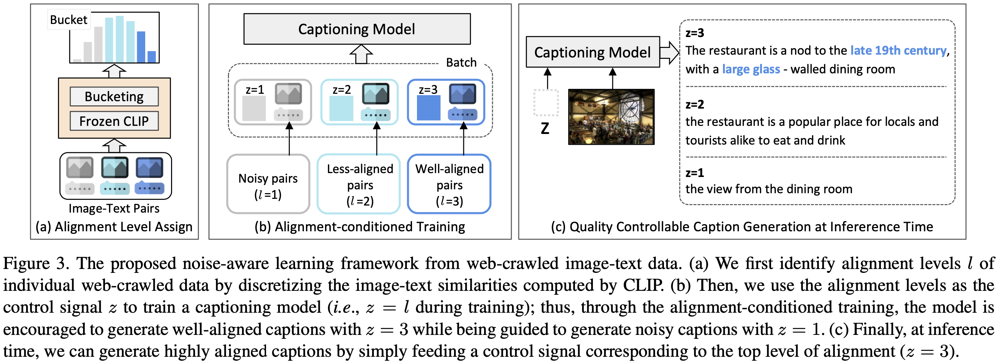

[](http://kakaobrain.com/)

# Noise-aware Learning from Web-crawled Image-Text Data for Image Captioning
This is an official PyTorch Implementation of **Noise-aware Learning from Web-crawled Image-Text Data for Image Captioning** [[arxiv]](https://arxiv.org/abs/2212.13563)
  - The method is a novel image captioning framework mainly for web-crawled image-text data.
  To be specific, the method addresses the noise issue in the web-crawled data by learning a quality controllable captioning model.
  Our model can generate high-quality captions of well-aligned by simply setting the control signal to desired alignment level at inference time and outperforms the filtering-based baseline algorithm.

<p align="center"></p>

## 1. Environmental Setup
We have tested the implementation on the following environment:
  * Python 3.7.11 / PyTorch 1.10.0 / torchvision 0.11.0 / CUDA 11.3 / Ubuntu 18.04

Also, the code is based on [pytorch-lightning](https://www.pytorchlightning.ai/) (==1.6.0) and all necessary dependencies can be installed by running following command.
```bash
$ pip install -r requirements.txt
```

For evaluation using [pycocotools](https://github.com/tylin/coco-caption), java is also required.
```
$ apt-get update
$ apt install default-jdk
```


## 2. Prepare Data
We provide a script to download data including (re-formatted) annotations for cc3m, coco, flickr30k and nocap datasets, and bucket file.

### 2-1. Prepare training and evaluation data
```bash
$ cd <path-to-root>
# download cc3m
$ bash scripts/download_cc3m.sh

# download mscoco
$ bash scripts/download_mscoco.sh

# download flickr30k
# For flickr30k data, you need to download raw images from (https://shannon.cs.illinois.edu/DenotationGraph/),
# the shell command below is for preparing only the annotation file
$ bash script/download_flickr30k.sh

# download nocaps
$ bash scripts/download_nocap.sh
```

Then, you need to download images from each dataset and locate the images within data folder whose structure should be as follows:
```bash
data
│─ bucket
│    │─ bucket_8bins.pickle  		 # bucketing file for cc3m data
│
│─ cc3m
│    │─ train_list_filtered_by_0.3.txt   # cc3m training annotation with filtering
│    │─ train_list.txt                   # cc3m training annotation
│    │─ val_list.txt                     # cc3m validation annotation
│    │─ images                           # link to root directory for images
│         │─ train                       # link to directory for training images
│         │─ val                         # link to directory for validation images
│
│─ coco
│    │─ captions_train2017.json          # training annotation
│    │─ captions_val2017.json            # validation annotation
│    │─ captions_karpathy_test.json      # Download on your own. Please check the scripts/download_mscoco.sh
│    │─ images                           # link to root directory for images
│         │─ val2017                     # link to directory for validation images
│         │─ val2014                     # link to directory for karpathy test split
│
│─ flickr30k
│    │─ ann_test.json                    # validation annotation
│    │─ images                           # link to root directory for images
│
│─ nocap
│    │─ val_4500_captions.json           # validation annotation
│    │─ images                           # link to root directory for images
│         │─ validation                  # link to directory for validation images
│
│─ pretrained_lm                         # will be automatically generated for gpt tokenizer
│    │─ gpt2_tokenizer                   # gpt2 tokenizer
│
│─ pretrained_clip                       # will be automatically generated for pre-trained clip model
```

## 3. Training
We use [Hydra](https://github.com/facebookresearch/hydra) to provide flexible training configurations.
Below examples explain how to modify each training parameter for your use cases.
We assume that you are in `<path-to-root>` (i.e., root of this repository).

Our training is based on distributed environment (multi-GPUs training) using [ddp environment supported by pytorch-lightning](https://pytorch-lightning.readthedocs.io/en/latest/advanced/multi_gpu.html).
The default setting requires 64-GPUs (of V100) with a total batch of 2048. However, you can set the parameter `config.DISTRIBUTED.NUM_PROC_PER_NODE` to the number of gpus you can use or change `config.experiment.effective_batch_size_train`.


**(1) Training with noise-aware framework on CC3M**

To run our NoC algorithm, you need a bucketing file of cosine similarities for all image-text pairs.

1) You can use the pre-computed bucketing file attached in `data/bucket/bucket_8bins.pickle`.

2) Or, you should generate the bucketing file with this following commands:
```bash
$ cd <path-to-root>
$ python3 preprocess/get_noc_bucket.py
```

Then, run a single command `bash scripts/train_cc3m_noc.sh` or following full command to train NoC model:
```bash
$ cd <path-to-root>
$ PYTHONPATH=./ python3 ./train.py \
		   distributed.num_nodes=16 distributed.num_proc_per_node=4 \
		   experiment.expr_name=cc3m_noc
```
Note that the checkpoints and log files (e.g., tensorboard) are automatically saved in `results/<EXPR_NAME>`.

**(2) Training baselines on CC3M**
```bash
$ cd <path-to-root>
$ bash scripts/train_cc3m_vanilla.sh    # for vanilla baseline

$ python3 preprocess/get_filtered_annotations.py  # generate filtered annotation for filtering strategy
$ bash scripts/train_cc3m_filtering.sh  # for vanilla (filtering) baseline
```


## 4. Evaluation
```bash
$ cd <path-to-root>
$ bash scripts/eval_all.sh <EXPR_NAME> 1  # our model, e.g., EXPR_NAME=cc3m_noc
$ bash scripts/eval_all.sh <EXPR_NAME> 0  # baselines, e.g., EXPR_NAME=cc3m_filtering, cc3m_vanilla
```


## 5. Model Zoo
We provide checkpoints to reproduce the results reported in our paper.

To predict captions from these checkpoints, decompress the .tar files and locate them in `<path-to-root>/results` .

| Method              | Checkpoint (pre-trained) |
|:--------------------|:------------------------:|
| Vanilla             | [download](https://arena.kakaocdn.net/brainrepo/models/noc/006229c7f6c6210e53aab9fb133e0d4e/vanilla_baseline.tar.gz)             |
| Vanilla (Filtering) | [download](https://arena.kakaocdn.net/brainrepo/models/noc/87f6a0e3cd8ac2d1ba7ba33dca45fd5d/filtering_baseline.tar.gz)             |
| NoC (ours)          | [download](https://arena.kakaocdn.net/brainrepo/models/noc/854d08dcbe219b0c2b2a3cf90d4c646a/noc.tar.gz)             |


## 6. Citation
If you find this code helpful for your research, please cite our paper.
```
@article{kang2022noise,
  title={Noise-aware Learning from Web-crawled Image-Text Data for Image Captioning},
  author={Kang, Woo Young and Mun, Jonghwan and Lee, SungJun and Roh, Byungseok},
  journal={arXiv preprint arXiv:2212.13563},
  year={2022}
}
```

## 7. Contact for Issues
Woo Young Kang, [edwin.kang@kakaobrain.com](edwin.kang@kakaobrain.com)
Jonghwan Mun, [jason.mun@kakaobrain.com](jason.mun@kakaobrain.com)


## 8. License
This project is licensed under the terms of the [MIT License](./LICENSE).
